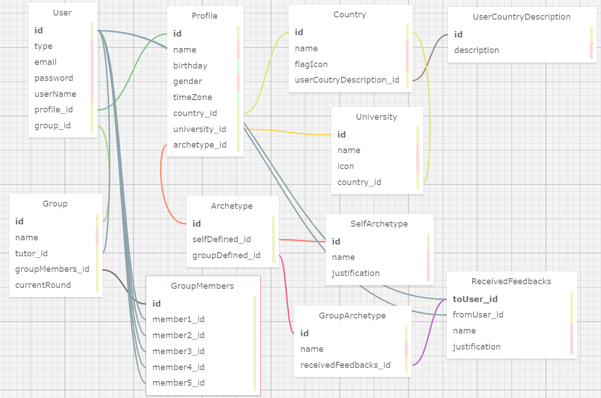

# Modelo Relacional
 
&nbsp;&nbsp;&nbsp;&nbsp;Esse repositório diz respeito à atividade ponderada proposta à turma 12 do Insituto de Tecnologia e Liderança no Módulo 02, no ano de 2024. A própria consistia no desenvolvimento de um modelo relacional relacionado ao banco de dados que seria desenvolvido para o projeto principal da turma, realizado em parceria com a Zuyd University of Applied Sciences. No entanto, o modelo apresentado a seguir não corresponde exatamente àquele que será usado pelo grupo do qual o aluno faz parte, neste caso o grupo 04 e o aluno João Pedro Ferreira Carbone, o qual possui autoria sobre a atividade desenvolvida.

&nbsp;&nbsp;&nbsp;&nbsp;Sendo assim, cabe analisar a definição de um modelo relacional: um modelo relacional de banco de dados é uma estrutura organizada que representa os dados em tabelas, onde cada tabela consiste em linhas e colunas. As relações entre essas tabelas são definidas por chaves primárias e estrangeiras, permitindo a criação de consultas complexas e eficientes. Este modelo facilita a integridade e consistência dos dados, proporcionando uma base sólida para sistemas de gerenciamento de banco de dados relacionais.

Figura 1 - Modelo Relacional Desenvolvido

Fonte: elaborado pelo autor

&nbsp;&nbsp;&nbsp;&nbsp;Esse modelo está disponível em seus arquivos [.xml](relationalModel.xml) e [.sql](relationalModel.sql). Para acessá-lo no navegador utilizando o programa [SQL Designer](https://github.com/ondras/wwwsqldesigner), basta acessar, dentro do programa, `Save / Load`, colar o texto `.xml` no espaço `Input  / Output` e, após, acessar `LOAD XML`.

&nbsp;&nbsp;&nbsp;&nbsp;As tabelas do modelo se relacionam da seguinte forma:

- `User`: Esta tabela contém informações do usuário, como id, tipo, email, senha, nome do usuário, id do perfil e id do grupo. Ela está conectada às tabelas Profile, Group e ReceivedFeedbacks.

- `Profile`: Armazena detalhes do perfil do usuário, como id, nome, data de nascimento, gênero, fuso horário, id do país, id da universidade e id do arquétipo. Está ligada às tabelas User, Country e University.

- `Country` e `University`: Estas tabelas contêm informações sobre o país e a universidade do usuário, respectivamente. A tabela Country está ligada à tabela Profile e a tabela University está ligada às tabelas Profile e Country.

- `Group`: Inclui detalhes sobre grupos, como id, nome, id do tutor, id dos membros do grupo e rodada atual. Está conectada à tabela User através do campo group_Id.
- `GroupMembers`: Esta tabela relaciona os membros aos grupos. Cada membro é representado por um id.
- `Archetype` e `SelfArchetype`: Estas tabelas armazenam informações sobre arquétipos definidos pelo grupo ou pelo próprio usuário. A tabela Archetype está ligada à tabela Profile através do campo archetype_id.
- `ReceivedFeedbacks`: Esta tabela registra feedbacks recebidos pelos usuários. Está ligada à tabela User.